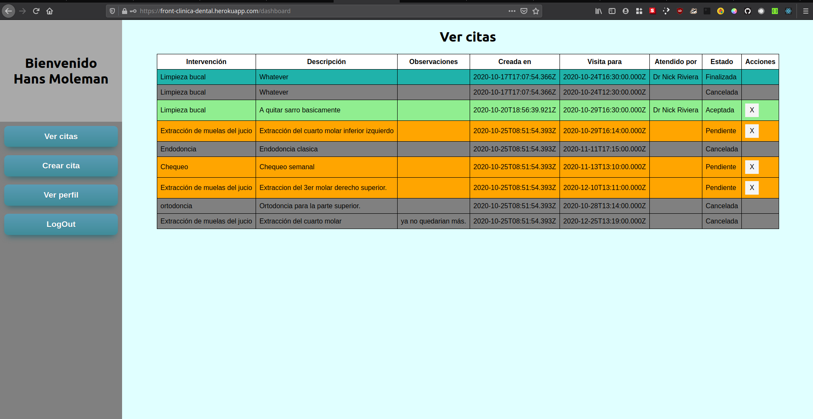

# FRONTEND for appointment app for a Dental Clinic

This is a project to introduce the use of REACT.

### Where to see the demo
-> https://front-clinica-dental.herokuapp.com/

### Is working with the backend from
-> https://appointment-dentist.herokuapp.com/
-> https://github.com/RafaLinaresMolina/FSD-BookingDentistApp

### A bit of background
This is an example of a frontend for an appointment app for a dental clinic.

Client can create appointments with state pending, can cancel appointments, watch all the history visualize their data on the profile page.
Admin can see all the appointments from all the users, watch all the logged users and watch his profile.

### Get the repo
- git clone https://github.com/RafaLinaresMolina/front_clinica_dental.git

### Install dependencies
- ```npm i```

### Add the configuration 

- Add the .env file with the next variables:
  - REACT_APP_BASE_URL: Base Url for the backend

### How to run it.
- ```npm start```

## The views
### Home page, if the user is not logged in allways be returned to it.
  
### Register page, user must fill all the required fields or the web will show the next errors.
  
  
### Login page, user must fill all the required fields or the web will show the next errors.
  
  
### Dashboard page, if the user is a client, will watch all of his appointments.
  
### Dashboard page, if the user is an admin, will watch all of the appointments of all users.
   
### A client can cancel an appointment if this isn't finished, a modal window will emerge for confirmation.
   
### when accepted the modal, the appointment should be cancelled. 
  
### The profile can be visualized too, for every user type of the application. 
  
  
### Regular users can create appointments, and must fill all the required fields. 
  
  
  
### Admins can visualize all the users logged
  

### Things definetly need rework

- When 401 errors happend, redirect to home and delete posible data in localstorage.
- When logged with an acount already logged, either revoke the old token or manage an array of them.

### Things i will love to add
- Unit-Testing
- Refactor, a lot o reractor.